<h1 align="center">Hola, soy Bruno García López 👋</h1>

<h3 align="center">Software Engineer · Automatización · Seguridad móvil</h3>

  Construyo software de extremo a extremo, automatizo procesos y analizo sistemas desde una perspectiva ofensiva y defensiva.

  
  
  
  
  

## Sobre mí

Programo desde los **16 años**. Empecé por curiosidad, intentando entender cómo funcionaban las aplicaciones por dentro, y esa curiosidad se convirtió en una forma de trabajar: investigar, diseñar, construir, automatizar y mejorar sistemas completos.

Actualmente soy **practicante en Bancom Perú** (antes Banco de Comercio) y cuento con **un año de experiencia profesional previa** como practicante. Me encuentro en el **tercio superior** de mi carrera y complemento mi formación académica desarrollando proyectos reales de backend, aplicaciones móviles, automatización y seguridad.

- 💻 Desarrollo software mantenible, modular y orientado al negocio.
- ⚙️ Automatizo procesos, pruebas e integraciones para reducir trabajo manual y errores.
- 🔐 Realizo auditorías autorizadas de aplicaciones móviles, análisis de vulnerabilidades y pruebas de seguridad.
- 📱 Tengo experiencia en pentesting móvil e ingeniería inversa sobre ARM.
- 🧠 Soy amante de las estructuras de datos, los algoritmos y la resolución de problemas desde sus fundamentos, sin depender de la IA.
- 🚀 Mi siguiente objetivo profesional es aportar y crecer como ingeniero en una Big Tech.
- ⚽ Fuera del código, disfruto jugar fútbol y experimentar con ideas poco convencionales.

## Áreas de especialización

### Ingeniería de software y backend

Diseño APIs, servicios y sistemas con separación clara de responsabilidades, pruebas automatizadas, persistencia, mensajería y observabilidad. He trabajado con arquitecturas modulares y hexagonales, integraciones en tiempo real y flujos tolerantes a fallos.

### Automatización y QA

Construyo herramientas para automatizar tareas operativas, consumo de APIs, extracción y transformación de datos, pruebas funcionales y validaciones end-to-end. Me interesa que el software sea reproducible, medible y fácil de verificar.

### Seguridad e ingeniería inversa

Analizo aplicaciones móviles y protocolos para comprender su superficie de ataque, detectar vulnerabilidades y proponer mitigaciones. Trabajo con análisis estático y dinámico, instrumentación, tráfico de red, arquitectura ARM y prácticas de desarrollo seguro, siempre dentro de entornos autorizados.

## Stack tecnológico

### Lenguajes

  
  
  
  
  
  
  

### Desarrollo

  
  
  
  
  
  
  
  

### Datos, integración y plataforma

  
  
  
  
  
  
  

### Seguridad, reversing y calidad

  
  
  
  
  
  
  

## Proyectos destacados

### 💧 EnRutaTuAgua · Proyecto privado

Mi proyecto principal: una plataforma para coordinar la distribución de agua mediante camiones cisterna. Integra un backend Java/Spring Boot con arquitectura hexagonal y una aplicación Android nativa en Kotlin. Incluye planificación de rutas, operación offline, cadena de custodia del agua, tracking GPS en tiempo real, MQTT, WebSocket, Kafka y PostgreSQL/PostGIS.

**Stack:** Java 21 · Spring Boot · Kotlin · Compose · PostgreSQL · MQTT · Kafka · Docker

> El código se mantiene privado, pero el proyecto refleja mi trabajo en arquitectura, backend, mobile, sistemas distribuidos, pruebas y despliegue.

### 🏢 FEBAN API · Proyecto privado

Plataforma empresarial modular para procesos administrativos y de salud. Trabajé sobre servicios backend, aplicaciones web y módulos relacionados con clínicas, contratos, procedimientos médicos, personas, recursos humanos y seguridad.

**Stack:** .NET · C# · APIs REST · Angular · TypeScript · SQL

### 🌐 AquaSocial · Proyecto privado

Producto full stack que reúne frontend y backend en una sola experiencia social. Comprende una aplicación web moderna, servicios API, autenticación, persistencia, pruebas end-to-end y despliegue, con énfasis en separación de responsabilidades y evolución mantenible.

**Stack:** .NET · C# · Angular · TypeScript · Tailwind CSS · Playwright

### 📲 [SMS-API](https://github.com/ihackurass/Google-Messages-SMS-API)

API de integración y automatización para Google Messages, diseñada para convertir operaciones de mensajería en capacidades reutilizables por otros sistemas.

### 🌊 [AquaTrack Perú](https://github.com/ihackurass/AquaTrack-Peru)

Aplicación para visualizar y gestionar información geoespacial sobre puntos de abastecimiento de agua en Lima Metropolitana. Incluye mapas, búsqueda, filtros, favoritos, historial y administración de datos.

**Stack:** Java · PHP · MySQL · JavaScript

### 🧩 [CaptchaSolver](https://github.com/ihackurass/iHackUrAss_CaptchaSolver)

Proyecto experimental de visión y automatización para el procesamiento de desafíos visuales.

## Actualmente

- 🏢 Practicante en **Bancom Perú**.
- 🎓 Estudiante perteneciente al **tercio superior**.
- 🧱 Profundizando en diseño de sistemas, arquitectura de software y sistemas distribuidos.
- 🧮 Resolviendo problemas de estructuras de datos y algoritmos desde primeros principios y sin depender de la IA.
- 🔐 Ampliando mis conocimientos en seguridad móvil, reversing ARM y desarrollo seguro.

## Estadísticas

  
  

## Contacto

Estoy abierto a conectar con personas interesadas en ingeniería de software, automatización, seguridad móvil y proyectos técnicamente desafiantes.

  
  

---

  <strong>Construir. Automatizar. Entender. Mejorar.</strong> 
  Convirtiendo curiosidad técnica en software confiable desde los 16 años.

